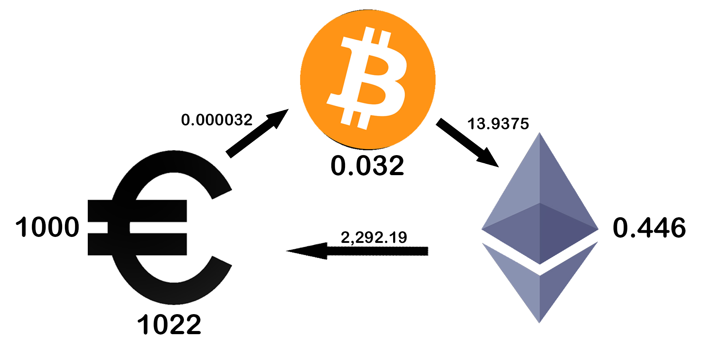
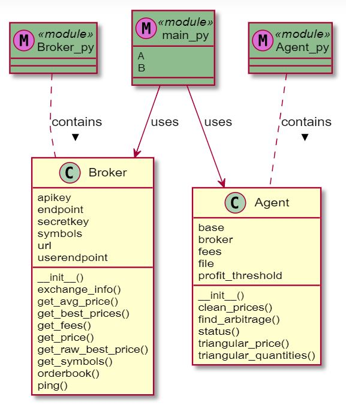
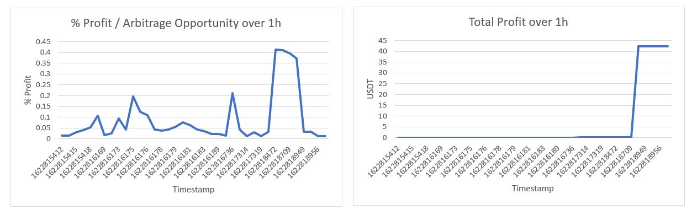

# Spotting Triangular Trading Arbitrage Opportunities on Binance

## Quick Project Description
- **Idea:** Make three currency conversion trades and end up with a profit.  
- **Technologies:** Python3, Binance API.  
- **Status:** In development.  

## How Triangular Arbitrage Works


The above graphic illustrates the process. Here, the system starts with 1000€, buys 0.032 BTC with an exchange rate of 0.000032, then buys 0.446 ETH with these BTC with an exchange rate of 13.9375 and finally buys 1022€ with these ETH with an exchange rate of 2,292.19. Disregarding transaction fees and time delay, this yields an instantaneous, risk-free net profit of 22€.  

These arbitrage opportunities occur regularly in the market, for a variety of reasons ranging from mistakes to a fast purposeful  liquidation of assets.  

## System Overview


We have two Python classes, Broker and Agent, for separation of concerns.

The Broker handles the interaction with the Binance Rust API and can be used to parse the API orderbook response into a python price dictionary from simple start to end currency with best-offer order price and quantity.  

The Agent implements the strategy, parsing the information passed on from the Broker to calculate profitable arbitrage opportunities. The Agent also accounts for trading fees and profit thresholding, prints the exact trade opportunities in the terminal and saves them to a local CSV database.  

*main.py* executes the trade logic and incorporates a delay to ensure compliant API behaviour.

## Results
After running the algorithm for one hour, using USDT as the only base asset, only allowing exactly three trades per opportunity and restricting API interaction to one per 1.5 seconds, the exemplary results can be summarized as follows:  

  
- **Number of Opportunities:** 38  
- **Relative Average Opportunity Profit:** 0.0878%  
- **Absolute Avgerage Opportunity Profit:** 1.1142 USDT  
- **Absolute Median Opportunity Profit:** 2.29E-06 USDT
- **Maximum Total Profit:** 42.3382 USDT

Interestingly, the opportunities vary within around one order of magnitude, relatively speaking. Absolutely speaking, there was only really one very profitable trade opportunity within this one hour, as the available quantity of all other trades was too small to create a real profit, with maximum median opportunity profit being completely unmeasurable in USDT currency and therefore purely hypothetical. That trade, however, could have made over 40 USDT alone.  

```
Most profitable Opportunity:

With 11301.9477 USDT, buy 4068.7012 LRC for 0.36 USDT each. 
Then sell for 11363.5 BUSD with exchange rate 0.3581. 
Finally, convert the BUSD back to 11366.9101 USDT with exchange rate 0.9997.

Absolute Gross Profit: 64.96 USDT,
Absolute Net Profit: 42.24 USDT.
```

## Next Steps

The major implementation problem to take advantage of these opportunities is time delay. When an opportunity arises, it closes within milliseconds. The process of buying and selling cryptographic assets can take a settlement time of many minutes though, for example due to block mining time limitations. Another important time restriction comes from the API response time. While the parsing of the information and strategy takes single-digit milliseconds, the API request loop takes an average of around 400ms, with times regularly exceeding 1s. This could be a problem with either the connection, the Python requests library or the Binance API. Additionally, the API requires a sleep time between requests, which was set to 1s in this experiment. In this 1s, many opportunities that only exist for ms can be missed. Also, some opportunities might not actually be exploitable but rather conversion errors, or too miniscule to exploit.  

Therefore, the next steps are
1. Time delay optimization
2. Implement order placing
3. Develop risk management system
4. Test strategy live in spot markets
5. Create Dashboard for overview and results
6. Extend opportunity parsing to more than three trades (k-angular over triangular)
7. Extend opportunity parsing to more than one base asset
