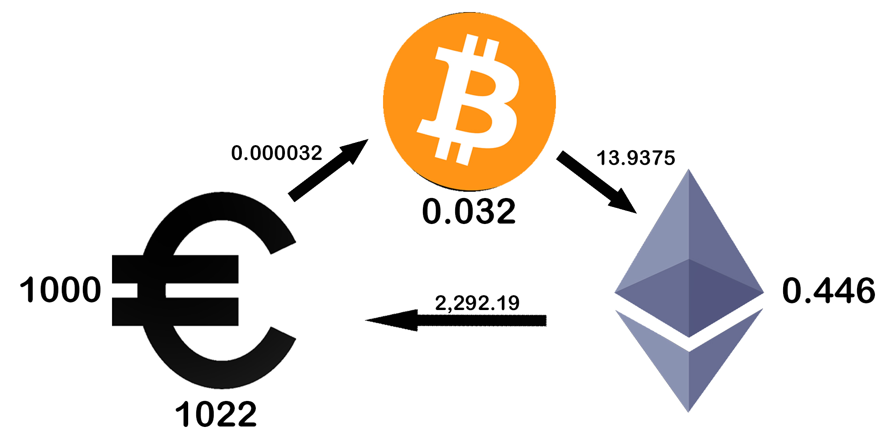
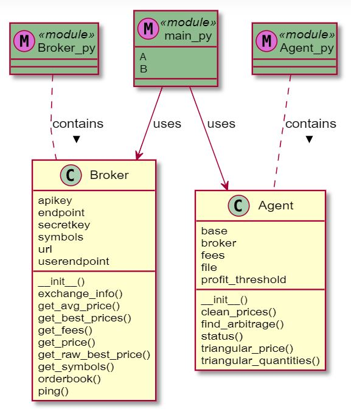

# Spotting Triangular Trading Arbitrage Opportunities on Binance

## Quick Project Description
Idea: Make three currency conversion trades and end up with a profit.  
Technologies: Python3, Binance API.  
Status: In development.  

## How Triangular Arbitrage Works

The above graphic illustrates the process. Here, the system starts with 1000€, buys 0.032 BTC with an exchange rate of 0.000032, then buys 0.446 ETH with these BTC with an exchange rate of 13.9375 and finally buys 1022€ with these ETH with an exchange rate of 2,292.19. Disregarding transaction fees and time delay, this yields an instantaneous, risk-free net profit of 22€.  

These arbitrage opportunities occur regularly in the market, for a variety of reasons ranging from mistakes to a fast purposeful  liquidation of assets.  

## System Overview

We have two Python classes, Broker and Agent, for separation of concerns.

The Broker handles the interaction with the Binance Rust API and can be used to parse the API orderbook response into a python price dictionary from simple start to end currency with best-offer order price and quantity.  

The Agent implements the strategy, parsing the information passed on from the Broker to calculate profitable arbitrage opportunities. The Agent also accounts for trading fees and profit thresholding, prints the exact trade opportunities in the terminal and saves them to a local CSV database.  

*main.py* executes the trade logic and incorporates a delay to ensure compliant API behaviour.

## Results and Next Steps
